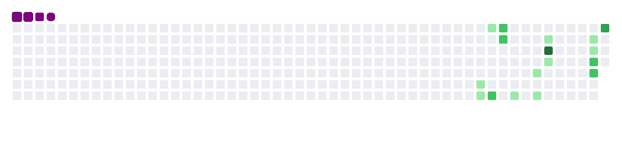

# 👋 Hi, I'm Christopher Oyuga

💻 **Frontend Web Developer.** | 🌐 **Aspiring Full-Stack Engineer.** | 🎨 **Graphic Designer.** | 🎥 **IT Specialist.**  

I’m an *IT Specialist* and *Frontend Developer* passionate about *technology*, *web development*, and *creating practical digital solutions*. I enjoy combining technical problem-solving with creative design to build modern, responsive, and user-friendly experiences.

---

## 🚀 About Me
- 🔭 **Currently working on:** Building and improving my personal portfolio and practical web projects.
- 💼 **Currently working at:** **Angata Sugar Mill ltd** as an *IT Specialist / IT Administrator.*
- 🖥️ **IT Focus:** IT administration, technical support, systems management, networking, and troubleshooting.
- 🌱 **Currently learning:** React, Node.js, REST APIs, databases, and full-stack development.  
- 👯 **Looking to collaborate on:** Open-source projects, web applications, IT solutions, and exciting technology projects.  
- 💬 **Ask me about:** Web development, IT support, IT administration, JavaScript, responsive design, Git/GitHub, and graphic design.
- ⚡ **Fun fact:** I enjoy solving technical problems, building useful digital solutions, and continuously exploring new technologies.  
- 📫 **Reach me:** *[Email](mailto:christopheroyga@gmail.com) | [LinkedIn](https://lnkd.in/eA2AS8gb) | [Portfolio](https://christopher-oyuga.github.io)* 
   

---

## 🛠️ Skills

💻 **Web Development Tools.**  
HTML5 | CSS3 | JavaScript | Git | GitHub | React | Canva | Photoshop | Animation..

🖥️ **IT & Systems**  
IT Administration.  

Technical Support & Troubleshooting.  

Hardware & Software Support.  

Systems Administration.  

Network Support & Configuration.  

User Account & Access Management.  

System Maintenance & Monitoring.

🎨 **Design & Creative.**  
Responsive Web Design

Graphic Design

Digital Content Design

Web Animation

🌐 **Currently Exploring.**
*Node.js · REST APIs · Databases · React · Full-Stack Development · Cloud Technologies.*

---

## 🏅 Badges & Profiles

## 📊 GitHub Status.
---

### 🔥 Streak Stats

---

## 🐍 GitHub Contribution Snake

  
  

  

---
### 👀 Profile Visitors

---
### 💬 Let's Connect
  
  

